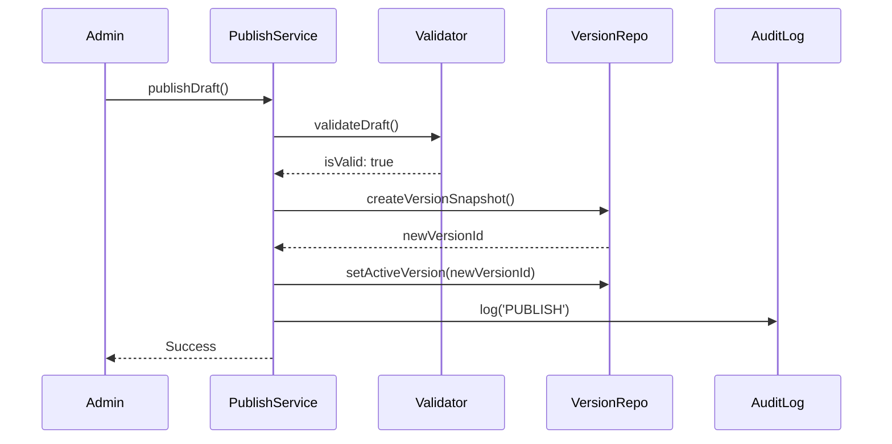

# Enterprise Admin Configuration Workflow (Phase 12)

The Admin Configuration Workflow guarantees that non-technical users can safely modify the engine's core logic without crashing the production system.

## 1. Entity Management Services
Standardized CRUD operations for Grants, Rules, RuleGroups, Questions, QuestionFlows, and Prompts.
Every single mutation immediately generates a granular **Audit Log**, ensuring total traceability of *who* changed *what* and *when*.

## 2. Pre-Flight Safety (Impact Analysis)
Before a user publishes their Draft changes, the `ImpactAnalysisService` calculates the "blast radius" of the deployment.
It compares the current Draft against the live Active configuration and reports:
- How many Rules and Grants were modified.
- How many active user sessions are currently relying on the old version.
If thousands of users are active, the admin is warned before publishing.

## 3. Strict Pre-Flight Validation
The `ConfigurationValidationService` acts as a compiler. Just like code won't compile with syntax errors, the engine refuses to publish a configuration that contains logic errors.
**Validation Checks:**
- **Broken References**: A RuleGroup referencing a deleted Rule.
- **Missing Data Fields**: A Rule attempting to evaluate a Question that has been retired.
- **Circular Nesting**: RuleGroups that infinitely nest into each other.
- **Duplicate Priorities**: Missing questions that share the exact same weight.

## 4. Immutable Publish Lifecycle
If validation passes, the `ConfigurationPublishService` executes an atomic database transaction.
1. It copies the entire Draft graph (Grants, Rules, Questions, etc.) into a serialized, frozen `SystemVersion` object.
2. It assigns a new UUID (e.g., `v_2.0.1`).
3. It moves the global `ActiveVersion` pointer to this new ID.
4. From that millisecond onward, all *new* user sessions use `v_2.0.1`.

## 5. Zero-Data Loss Rollback
If a published configuration contains an unforeseen business flaw, the `RollbackService` can instantly revert the system.
Because previous versions are stored as immutable snapshots, the rollback operation takes `< 5ms`. It simply moves the `ActiveVersion` pointer back to `v_2.0.0` and logs an audit trail.

## Sequence Diagram: Publish Flow

