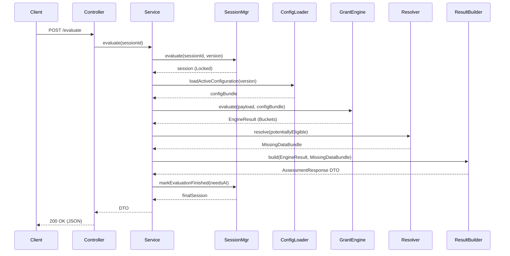

# Engine Integration Layer (Phase 11)

The Integration Layer successfully orchestrates all the independent modules of Grant Engine V2 into a cohesive, production-ready pipeline.

## Audit Report: How Modules Connect

Previously, modules like `GrantEngine`, `RuleEvaluator`, and `ResultBuilder` existed in isolation. They are now wired together inside `AssessmentService.ts`.

1. **Client -> API Controller**: The Frontend sends a POST request to `/v2/assessment/evaluate`. The `AssessmentController` receives this and routes it to `AssessmentService`.
2. **Session Layer**: `AssessmentService` locks the session state via `SessionManager.evaluate(sessionId)`. The `SessionManager` relies on its internal optimistic locking (`SessionSaver`) to ensure the user isn't trying to overwrite it concurrently.
3. **Configuration Layer**: The exact `configVersionId` from the session is passed to `IConfigurationLoader.loadActiveConfiguration()`. This ensures the evaluation is strictly locked to the version the user started with.
4. **Evaluation Pipeline**:
    - **`GrantEngine`**: Receives the config and the session payload, and executes the stateless evaluation (`RuleGroupEvaluator` -> `RuleEvaluator`), bucketing grants into `eligible`, `potentiallyEligible`, etc.
    - **`MissingDataResolver`**: Analyzes the `potentiallyEligible` bucket to extract the exact dynamic questions required to prove eligibility.
    - **`RankingEngine`**: Ranks and sorts the `eligible` grants based on the business rules.
5. **Presentation Layer**: **`ResultBuilder`** consumes the raw engine outputs, calculates final statistics, builds the AI context, strips out MongoDB IDs, and produces a clean JSON schema for the frontend.
6. **State Finalization**: The Service asks `SessionManager` to finalize the state to either `COMPLETED` or `AI_REQUIRED` depending on whether the `MissingDataResolver` found questions.

## Sequence Diagram

## Error Handling & Resilience
- **Optimistic Locking**: Handled gracefully. If `SessionManager` throws an `OptimisticLockError`, the Controller intercepts it and returns a `409 Conflict`, telling the frontend to retry.
- **Validation Failures**: Yields a `400 Bad Request`.
- **System Failures**: Yields a `500 Internal Server Error`, and if the process dies mid-evaluation, the `SessionRecovery` module will auto-heal it on the next load attempt.
