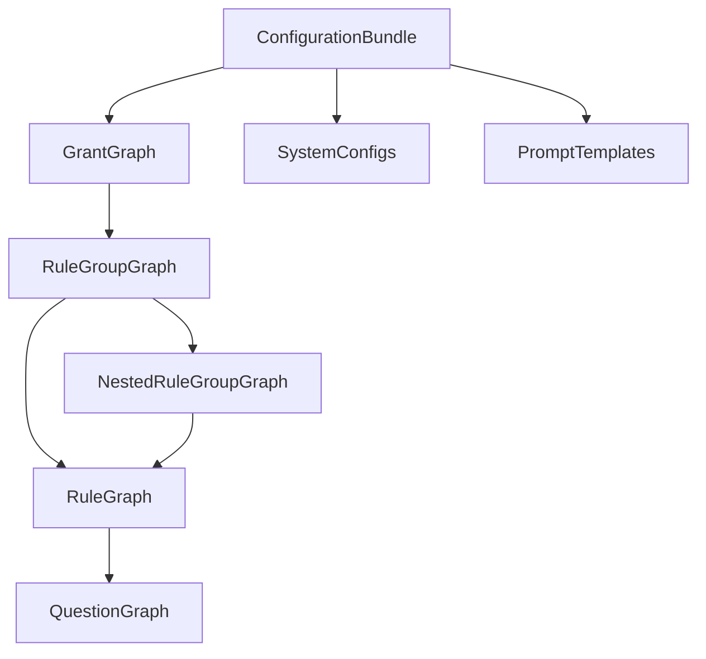

# Grant Engine V2: Configuration Layer Documentation

The V2 Configuration Layer is the database-driven foundation of the Grant Matching Platform. It replaces hardcoded JSON arrays with highly scalable MongoDB collections and strongly typed graphs.

## 1. Folder Structure
```text
backend/src/engine/v2/config/
├── dto/
│   └── index.ts                # Data Transfer Objects
├── interfaces/
│   └── index.ts                # Graph Node Typings
├── repositories/               # Mongo Abstractions
│   ├── ConfigRepository.ts
│   ├── GrantRepository.ts
│   ├── PromptRepository.ts
│   ├── QuestionRepository.ts
│   ├── RuleGroupRepository.ts
│   └── RuleRepository.ts
├── services/
│   ├── GraphBuilder.ts         # Assembles DB flat records into Graphs
│   ├── PublishService.ts       # Orchestrates Validation -> Freeze -> Active
│   └── VersionManager.ts       # Handles immutable snapshot versions
├── loaders/
│   └── ConfigurationLoader.ts  # Fetches and returns the entire active bundle
└── validators/
    └── ConfigurationValidator.ts # Catches circular dependencies & broken refs
```

## 2. Graph Diagram (In-Memory)
Once `ConfigurationLoader` completes, the engine holds this exact in-memory structure without N+1 query bottlenecks:


## 3. Loading Flow
1. API (or Cron) calls `ConfigurationLoader.loadActiveConfiguration()`.
2. Repositories fetch all active (`status: 'ACTIVE'`) Grants, Rules, RuleGroups, and Questions in parallel.
3. `GraphBuilder.build()` iterates over the arrays, mapping internal object references.
4. Returns the massive `ConfigurationBundle`.

## 4. Publish Lifecycle
1. Admin clicks "Publish" in UI.
2. API calls `PublishService.publishConfiguration()`.
3. Validation runs. If errors exist, publish halts.
4. `VersionManager.createSnapshot()` generates a new immutable snapshot in the `Version` collection for every grant/rule.
5. `AuditLog` writes the update.
6. Target configuration transitions to `ACTIVE`.

## 5. Validation Lifecycle
- Validates that no two active grants share the same ID.
- Detects circular dependencies within Rule Groups.
- Ensures operators provided in rules are within the strict enum (`equals`, `contains`, etc.).
- Flags missing nested definitions.

## 6. Version Lifecycle
- **DRAFT**: Admin is editing, not active.
- **ACTIVE**: Currently in production, handles live traffic.
- **ARCHIVED**: Replaced by a newer active version. Assessment sessions locked to archived versions continue to evaluate using the historical `snapshot`.

## 7. Repository Responsibilities
- Strictly isolating Mongoose queries from the engine.
- Returning lean POJOs (Plain Old JavaScript Objects) formatted as DTOs.
- Executing `upsert` queries for Seeders.

## 8. Future Redis Integration
- `ConfigurationLoader` will be updated to check Redis (`GET v2_active_config`) before hitting the Repositories.
- `PublishService` will invalidate the Redis key (`DEL v2_active_config`) upon successful publish.

## 9. Future Gemini & RAG Integration
- The DB now holds `PromptTemplates` with injection variables like `{{missingFields}}`.
- The `aiContext` inside `Questions` provides semantic guidelines for the AI.
- Future RAG (Retrieval-Augmented Generation) context chunks can be modeled alongside these components as vectors.

## 10. Future Admin Panel Integration
- The Admin API can now interact entirely via the `Repositories` and `VersionManager` without touching application logic or requiring a code deployment.
