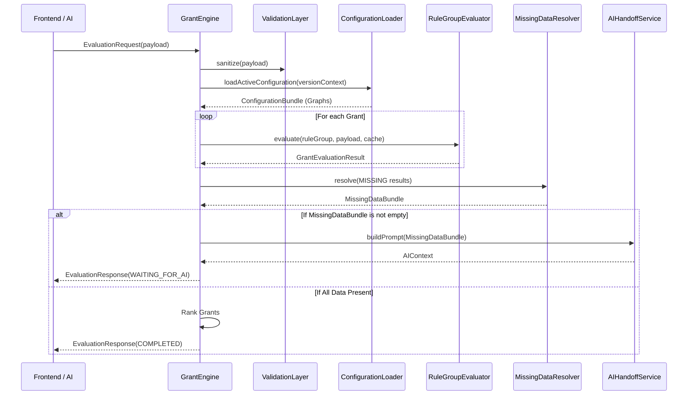
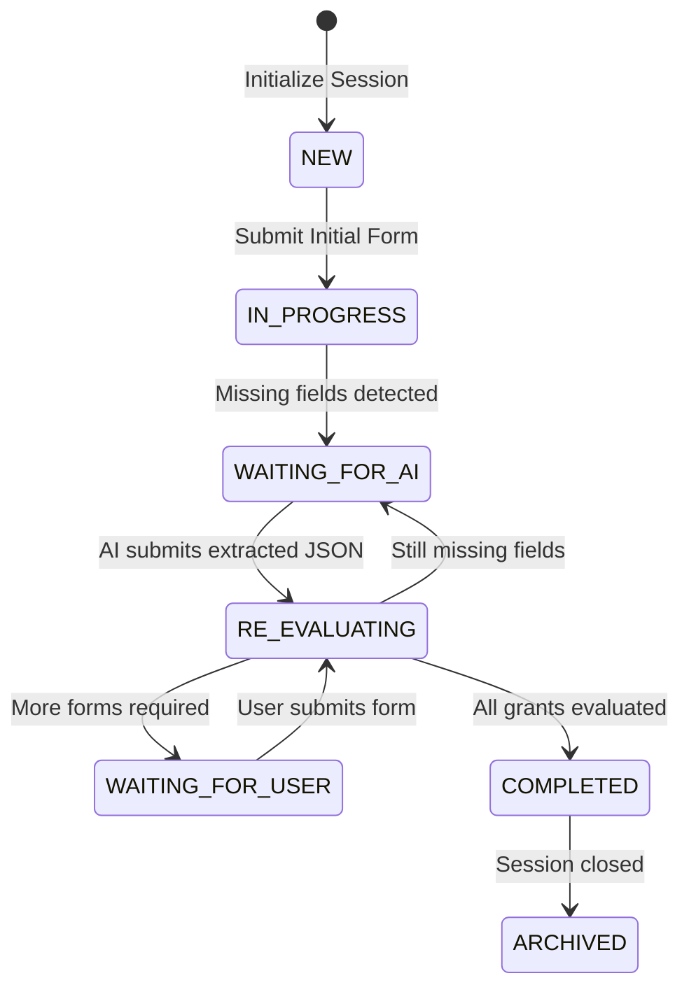
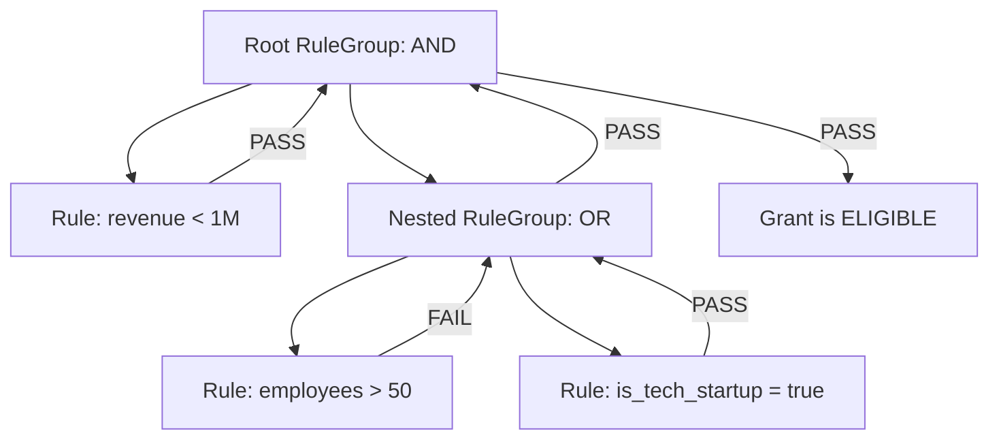

# Grant Engine V2: Execution Contracts & Architecture

This document defines the frozen architectural contracts for the Grant Engine V2 execution layer. These interfaces and lifecycles must be strictly adhered to during implementation to ensure modularity and scalability.

---

## 1. Request Lifecycle Pipeline
The execution of a Grant Evaluation follows a strict 11-step pipeline. 

---

## 2. Assessment Session State Machine
The `AssessmentSession` tracks user progress. It transitions predictably and prevents duplicate or out-of-order evaluations.

---

## 3. Evaluation Flow & Rule Aggregation
Evaluation operates on a strict boolean logic tree. The `RuleGroupEvaluator` recursively navigates `RuleGraph` and `RuleGroupGraph` nodes.

### Aggregation Rules
- **AND Group**: 
  - If any child evaluates to `FAIL`, short-circuit and return `FAIL`.
  - If any child evaluates to `MISSING`, continue evaluating others, but the group ultimately returns `MISSING` (unless a `FAIL` is encountered later, which overrides `MISSING`).
  - If all children return `PASS`, return `PASS`.
- **OR Group**:
  - If any child evaluates to `PASS`, short-circuit and return `PASS`.
  - If all children evaluate to `FAIL`, return `FAIL`.
  - If no children `PASS` and at least one is `MISSING`, return `MISSING`.
- **Missing Propagation**: A `MISSING` state bubbles up to the Grant root, transitioning the grant state to `NEEDS_INFORMATION`.

---

## 4. Memoization Strategy
To prevent redundant evaluations across hundreds of grants sharing the same rules (e.g., "Is Company Registered in SG?"), the `GrantEngine` maintains a per-request `EngineContext` cache.

- **Rule Cache**: `Map<ruleId, EvaluationState>`. Before evaluating a `RuleGraph`, check this cache.
- **Group Cache**: `Map<groupId, EvaluationState>`. Caches whole `RuleGroupGraph` evaluations.
- **Cache Scope**: The cache is instantly destroyed at the end of the HTTP request. It does NOT persist across sessions.

---

## 5. Transaction Boundaries
To ensure database integrity during the Assessment Lifecycle:
1. **No Partial Saves**: An `AssessmentSession` document is only written to MongoDB after the *entire* Grant iteration loop completes. If the evaluator throws an unhandled error on Grant 99 of 100, the session state does not save.
2. **Immutability**: `EvaluationContext.payload` is frozen `Object.freeze()` immediately upon receiving the request to prevent side-effect mutations during rule execution.
3. **Version Locking**: Every request verifies `versionId`. If the admin publishes a new configuration while a user is in `WAITING_FOR_AI`, the user continues evaluating against the archived snapshot they started with.

---

## 6. Execution Interfaces
*See `src/engine/v2/interfaces/execution.ts` for the complete TypeScript contract definitions.*
